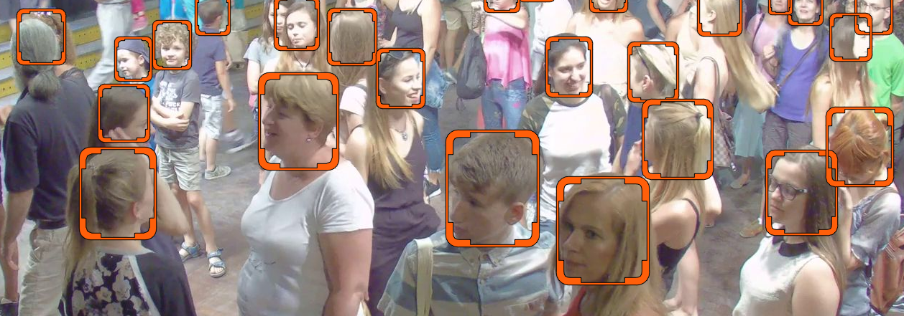

# Head Detection Demo

This section demonstrates the setup and usage of the [Head Detection] feature.

The demo plays video from a JPEG topic and visualizes the head detection:



## Prerequisites

Before starting the demo ensure the following:

* UVAP is installed as instructed in [Setting Up UVAP]
* UVAP is configured in `base` demo mode as instructed in [Configuring UVAP for Base Demo Mode]
* The following microservices are running:
  * [Multi-Graph Runner]
* Web display is started as instructed in [Starting Web Player].

Required topics:

* `base.cam.0.original.Image.jpg`
* `base.cam.0.dets.ObjectDetectionRecord.json`

## Start Head Detection Demo
   
Start the demo with `run_demo.sh`:
   
   ```
   $ "${UVAP_HOME}"/scripts/run_demo.sh --demo-name head_detection \
     --demo-mode base -- --net uvap
   ```

   >**Note:**  
   After the first run of these scripts it is recommended that `set_retention.sh script`
   is executed manually because new (`*.Image.jpg`) topics are created. For
   further information, see [Setting the Retention Period].

## Display in Web Browser

Navigate to the following URL to display the demo:
  
   ```
   http://localhost:9999#base.cam.0.head_detection.Image.jpg
   ```

[Configuring UVAP for Base Demo Mode]: demo_config_base.md#configuring-uvap-for-base-demo-mode
[Head Detection]: ../feat/detect_person/feat_head_det.md#head-detection
[Multi-Graph Runner]: ../dev/start_mgr.md#starting-multi-graph-runner
[Setting the Retention Period]: demo_set_ret.md#setting-the-retention-period
[Setting Up UVAP]: ../install/uvap_install_setup.md#setting-up-uvap
[Starting Web Player]: demo_web_player.md#starting-web-player
