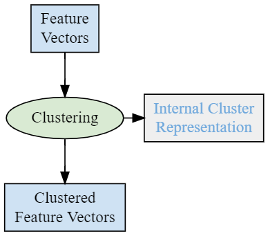

# Single Camera Reidentification Demo with Pre-clustering

This section demonstrates the setup and usage of the [Reidentification] feature
in a one-camera system.

The **Reidentifier** microservice processes feature vectors and finds
re-appearances. In the demo, identified people are marked with an orange
bounding box and an auto increment ID. People not identified are marked with
a grey bounding box. It is also possible to calculate the dwell time passed
between the registration and reidentification.

  
_One-Camera System Registration_

  
_One-Camera System Reidentification_

In a one-camera system, a single camera registers and reidentifies the appearing
people.

Reidentification uses single feature vetors of previously detected faces and
compares them to newly detected ones to recognize reappearances. Pre-clustering
creates clusters of recognized and stored feature vectors based on their similarity.

Each stored cluster has a representative feature vector which is continuously updated
when recognizing new feature vectors that fit in an existing cluster (or a new cluster
is created if the new feature vector does not match any existing clusters). Using pre-
clustering can increase the accuracy of the reidentification by using representative
feature vectors of the stored clusters instead of single ones.

  
_Clustering Concept_  

## Prerequisites

Before starting the demo, ensure the following:

* UVAP is installed as instructed in [Setting Up UVAP]
* UVAP is configured in `fve` demo mode as instructed in [Configuring UVAP for FVE Demo Mode]
* The following microservices are running:
  * [Multi-Graph Runner]
  * [Feature Vector Clustering]
  * [Reidentifier]
* Web display is started as instructed in [Starting Web Player].

**Reidentifier** microservice requires video(s) with faces larger than 128
pixels, looking straight into the camera.

Required topics:

 * `fve.cam.0.original.Image.jpg`
 * `fve.cam.0.dets.ObjectDetectionRecord.json`
 * `fve.cam.0.fvecs.FeatureVectorRecord.json`
 * `fve.cam.99.reids.ReidRecord.json`

## Starting One-Camera Reidentification Demo

Start the demo with `run_demo.sh`:

>**Attention!**  
After the first run of these scripts, execute `set_retention.sh` script
manually because new (`*.Image.jpg`) topics are created.

```
$ "${UVAP_HOME}"/scripts/run_demo.sh \
  --demo-name reidentification \
  --demo-mode fve -- --net uvap
```

## Display in Web Browser

Navigate to the following URL to display the demo:

```
http://localhost:9999#fve.cam.0.reids.Image.jpg
```

[Reidentifier]: ../dev/start_reid.md#starting-reidentifier
[Configuring UVAP for FVE Demo Mode]: demo_config_fve.md#configuring-uvap-for-fve-demo-mode
[Multi-Graph Runner]: ../dev/start_mgr.md#starting-multi-graph-runner
[Reidentification]: ../feat/face_prop/feat_reid.md#reidentification
[Setting Up UVAP]: ../install/uvap_install_setup.md#setting-up-uvap
[Starting Web Player]: demo_web_player.md#starting-web-player
[Web display]: demo_web_player.md#web-display
[Feature Vector Clustering]: ../dev/start_fv_clustering.md
