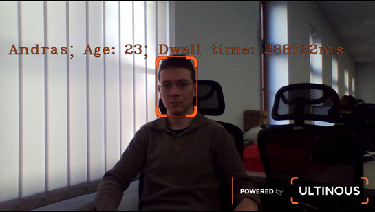

# Reidentification Demo with Person Names

This section demonstrates the setup and usage of the [Reidentification] feature demo with a manually updated
stream of person names. 
In the Reidentification demos, recognized faces (feature vector clusters) are marked with IDs generated by 
the demo application in the order of appearance. In this demo, however, it is also possible to associate 
person names to any given ID manually. When such persons re-appear, their names will be displayed instead of 
the automatically generated IDs. Using an optional switch of the demo, the age, dwell time, or both 
can also be displayed for each person.

## Prerequisites

Before starting the demo, ensure the following:

* UVAP is installed as instructed in [Setting Up UVAP]
* UVAP is configured in `fve` demo mode as instructed in [Configuring UVAP for FVE Demo Mode]
* The following microservices are running:
  * [Multi-Graph Runner]
  * [Reidentifier]
  * [Feature Vector Clustering]
* Web display is started as instructed in [Starting Web Player].

**Reidentifier** microservice requires video(s) with faces larger than 72
pixels. It works best if people look straight into the camera.

Required topics:

* `fve.cam.0.original.Image.jpg`
* `fve.cam.0.dets.ObjectDetectionRecord.json`
* `fve.cam.0.fvecs.FeatureVectorRecord.json`
* `fve.cam.99.reids.ReidRecord.json`  
* `fve.cam.0.ages.AgeRecord.json`

To view existing Kafka topics, use the following command:  
```
$ docker exec -it kafka /bin/bash -c \
  'kafka-topics --list --zookeeper zookeeper:2181'
```

## Starting the Reidentification Demo with Person Names  

Start the demo with `run_demo.sh`:
```
$ "${UVAP_HOME}"/scripts/run_demo.sh \
  --demo-name reid_with_name \
  --demo-text [label] \
  --demo-mode fve -- --net uvap
```

The `--demo-text [label]` switch is optional, where `[label]` can be one of the following:
* `none` (displays nothing)
* `age`
* `dwell_time`
* `both` (displays age and dwell time)

The default value (in case the switch is omitted) is `none`. The ID or person name (if associated) is always displayed.

## Associating Names to Recognized Persons

Once the demo is running, the displayed person IDs can be replaced by names, 
i.e. user-defined strings. Set names with `names.sh`:
```
$ "${UVAP_HOME}"/scripts/names.sh [broker_name] [person_id] [person_name]
```
Where:
* `[broker_name]` is the kafka server name - usually kafka:9092
* `[person_id]` is the ID in the cluster record
* `[person_name]` is the name to be displayed when the person is reidentified

## Display in Web Browser

Navigate to the following URL to display the demo:

```
http://localhost:9999#fve.cam.0.reids.Image.jpg
```
Where `fve.cam.0.reids.Image.jpg` is the topic created by the demo.

  
_Demo display with `--demo-text both` switch_

## Running the Demo on a Two-Camera setup

This demo can also be run with two-camera setup if the following prerequisites are met:

* UVAP is installed as instructed in [Setting Up UVAP]
* UVAP is configured in `fve` demo mode as instructed in [Configuring UVAP for FVE Demo Mode]
* The following microservices are running:
  * [Multi-Graph Runner]
  * [Reidentifier]
  * [Feature Vector Clustering]
* Web display is started as instructed in [Starting Web Player].

In a two-camera system, registration and reidentification are performed on
both cameras. Each camera has both of the following two roles:

* **Registration**:  
  Feature vectors from the camera stream are stored as a new identity or update an already stored identity.
* **Reidentification**:  
  Feature vectors from the camera stream are compared to stored clusters and matching identities are returned.

**Reidentifier** microservice requires video(s) with faces larger than 72
pixels, looking straight into the camera.

Required topics:

 * `fve.cam.0.original.Image.jpg`
 * `fve.cam.0.dets.ObjectDetectionRecord.json`
 * `fve.cam.0.fvecs.FeatureVectorRecord.json`
 * `fve.cam.99.reids.ReidRecord.json`
 * `fve.cam.1.original.Image.jpg`
 * `fve.cam.1.dets.ObjectDetectionRecord.json`
 * `fve.cam.1.fvecs.FeatureVectorRecord.json`

To display ages as well, the `fve.cam.0.ages.AgeRecord.json`
and `fve.cam.1.ages.AgeRecord.json` topics will also be required.

In this case both camera and output streams can be processed and displayed
without any further configuration.

[Reidentification]: ../feat/face_prop/feat_reid.md
[Reidentifier]: ../dev/start_reid.md#starting-reidentifier
[Configuring UVAP for FVE Demo Mode]: demo_config_fve.md#configuring-uvap-for-fve-demo-mode
[Multi-Graph Runner]: ../dev/start_mgr.md#starting-multi-graph-runner
[Setting Up UVAP]: ../install/uvap_install_setup.md#setting-up-uvap
[Starting Web Player]: demo_web_player.md#starting-web-player
[Web display]: demo_web_player.md#web-display
[Feature Vector Clustering]: ../dev/start_fv_clustering.md
