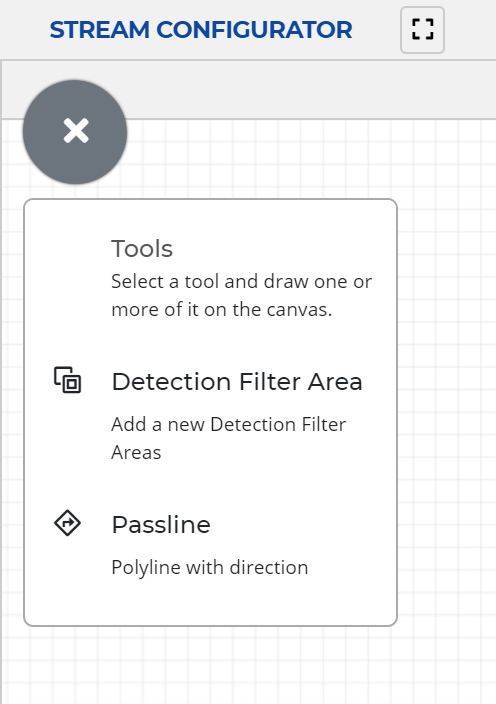
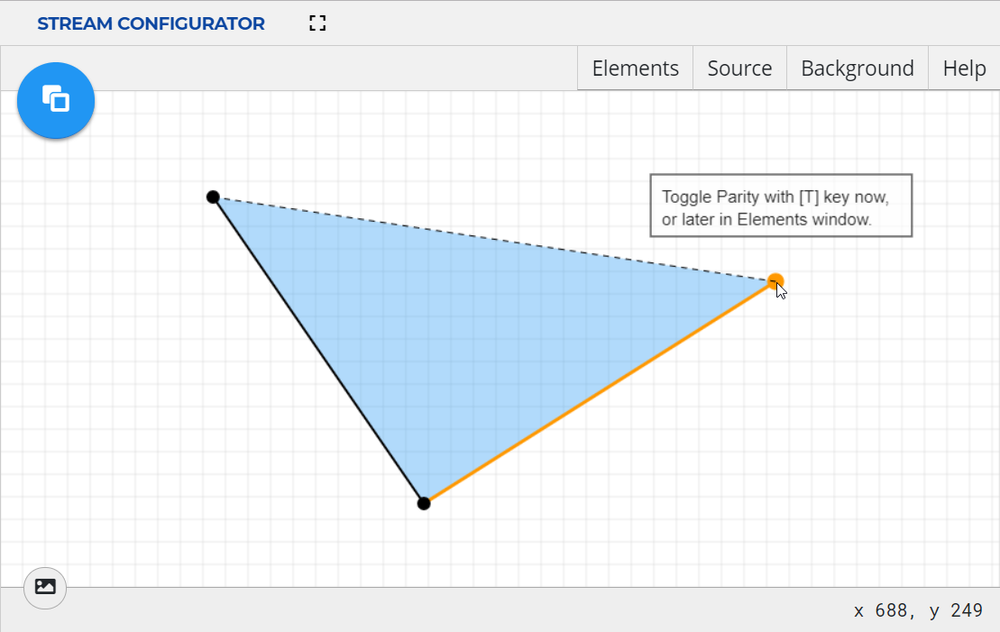
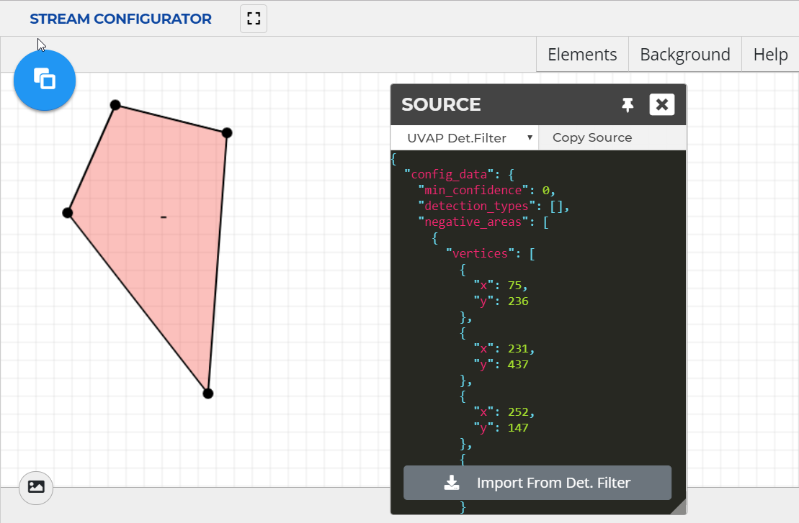

# Configuring Detection Filter Areas

Configuring detection filter areas in the Stream Configurator UI allows for
quick and easy area creation and management.

For information on the Stream Configurator UI, see the [Stream Configurator UI Guide].

## Creating a New Filter Area

A detection filter area is a chain of coordinates (joints). At least three
joints are needed to define an area.

To create a detection filter area:

>**Note:**  
Until the element is finished, any step can be undone with a **right-click**,
automatically jumping back to the previous action.  

1. Enter **Detection Filter Areas** mode by selecting **Detection Filter Areas**
in the new element drop-down menu.
   
   

1. Start a detection filter area with a **left-click** anywhere on the canvas
to place its first joint.

1. Add a joint with a **left-click** anywhere on the canvas.  
   Any number of joints can be added to a detection filter area.

   >**Note:**  
   While in Detection Filter Area mode, parity of the area can be toggled by
   pressing `T`.

1. Finish the area with a **double-click** on the first joint or to place the
last joint where the cursor is.
      
1. Exit the **Detection Filter Areas** mode by clicking the detection filter area icon.

>**Note:**  
Exiting the **Detection Filter Areas** mode automatically completes unfinished
areas if at least three joints are defined.

  
***New Detection Filter Area***

## Importing Detection Filter Areas

**Stream Configurator** provides an import function, to make **Detection Filter**
configuration easier. From the **Detection Filter** configuration under
`ultinous.service.kafka.detection.filter.config`, the vertices snippet can be
copied and imported into **Stream Configurator** for easier graphical management. 
For more information on **Detection Filter** configuration, see [Configuring Detection Filter].
  
>**Attention!**  
For this feature to work as intended the Stream Configuration UI needs to
access the clipboard. Make sure clipboard access is not blocked by the browser.

To import a detection filter snippet:

1. Open the **Source** window.

1. Ensure that the format is set to `UVAP Det.Filter`. Select it from the drop-down
   menu if necessary.

1. From an external source — such as the **Detection Filter** configuration — copy
   a valid detection filter snippet configuration to the clipboard.

1. Select **Import From Det. Filter**. Approve clipboard access if the window pops up.  
Importing invalid configurations results in an error.

## Exporting Detection Filter Areas

**Stream Configurator** provides an export function, to make **Detection Filter**
configuration easier. The created detection filter snippet can be copied to the
clipboard, then pasted into the **Detection Filter** configuration file
under `ultinous.service.kafka.detection.filter.config`. For more information on
**Detection Filter** configuration, see [Configuring Detection Filter].

To export a detection filter snippet:

1. Open the **Source** window.

1. Make sure that the format is set to `UVAP Det.Filter`. Select it from the drop-down
   menu if necessary.

1. Select **Copy Source**.
   The detection filter configuration is copied to the clipboard.

1. Paste the clipboard content into a the **Detection Filter** configuration
   file (as a value for `ultinous.service.kafka.detection.filter.config`) or to a
   separate file to store the detection filter configuration.

  
***Example Detection Filter***

## Managing Existing Detection Filter Areas

### Removing a Detection Filter Area

To remove a detection filter area:

1. Open the **Elements** window.

1. Enter **Edit** mode by clicking the name of the detection filter area.

1. Select **Delete**
   ()
   to delete the detection filter area.

### Removing All Elements

To remove all elements:

>**Attention!**  
This option removes both passlines and detection filter areas!

1. Open the **Elements** window.

1. Select **Remove all**.
   A window pops up.

1. Select **OK**.

### Cloning a Detection Filter Area

Cloning a detection filter area creates a new object with the same joint coordinates.
The joints and parity can be modified later.

To clone a detection filter area:

1. Open the **Elements** window.

1. Enter **Edit** mode by clicking the name of the detection filter area.

1. Select **Clone Object**.

1. Select **Save**.

### Hiding or Revealing a Detection Filter Area

To hide or reveal a detection filter area:

1. Open the **Elements** window.

1. Select **Toggle Visibility**
  ( or )
  for the detection filter area to be hidden or revealed.
  
Additionally, **Toggle Visibility** can be clicked to reverse the visibility of
all elements.
  
### Adding a Joint

To add a detection filter area joint:

1. Open the **Elements** window.

1. Enter **Edit** mode by clicking the name of the detection filter area.

1. Click on the midpoint to add a joint.

1. Select **Save**.

### Moving a Joint

To move a detection filter area joint:

1. Open the **Elements** window.

1. Enter **Edit** mode by clicking the name of the detection filter area.

1. **Left-drag** an existing joint to move it.

1. Select **Save**.

### Removing a Joint

To remove a detection filter area joint:

1. Open the **Elements** window.

1. Enter **Edit** mode by clicking the name of the detection filter area.

1. **Right-click** an existing joint to remove it.

1. Select **Save**.

[Configuring Detection Filter]: conf_det_filter.md
[Stream Configurator UI Guide]: conf_sc_ui.md
