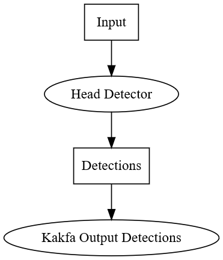

# Configuring Multi-Graph Runner

To configure an **MGR** instance, the combination of the different algorithms needs
to be specified. **MGR** can be configured with a dataflow graph. The **MGR** dataflow
is a directed bipartite graph consisting of data nodes and process nodes.

This model is very similar to the UVAP dataflow. However, **MGR** deals with
high-bitrate uncompressed video streams. This data cannot be transferred over
Kafka due to the I/O and network limitations. **MGR** deals with low-level image
processing algorithms while the rest of the microservices deal with higher level
lightweight data.

Another significant difference is that the **MGR** dataflow is synchronized:
all the processing nodes (within one `data_run`, see later) are called exactly
once for each input frame in dependency order.

## Configuration File Format

The dataflow configuration is a text file following the prototext
(`.prototxt`) format. It is a simple structured format, best can be understood
from the example below. Formal definition of the configuration file is
given in the [UVAP MGR configuration format proto file].

 >**Note:**  
 `.proto` and `.prototxt` are two different formats. `.prototxt` is
 used to configure **MGR** while `.proto` is used to formally define the possible
 configuration options. For more information on these formats, see
 <a href="https://developers.google.com/protocol-buffers/docs/overview" target ="_blank">Protocol Buffers</a>.

The following is an example of a specified Region of Interest (ROI) cropping
process node in configuration part (`.prototxt`):

   ```
   ...
   # comment is hash mark in prototxt
   process_node {
     type: ROI
     name: "roi1"
     roi_config {
       input: "input"
       output: "roi1"
       x: 400
       y: 200
       width: 400
       height: 400
     }
   }
   ...
   ```

The following example is the corresponding parts of the formal `.proto`
definition (`...` is used to substitute for omitted parts):

   ```
   message DataFlowGraphConfig {
     ...
     repeated ProcessNodeConfig process_node = 3; // the process nodes
     ...
   }
   
   ...
   message ProcessNodeConfig {
     enum Type {
       ...
       ROI = 2;
       ...
     }
   
     required Type type = 1;
     required string name = 2;
     ...
     optional ROIConfig roi_config = 6;
     ...
   }
   ...
   message ROIConfig {
     required string output = 2; // output FRAME
   
     required int32 x = 3; // x coordinate of the top left corner in pixels
     required int32 y = 4; // y coordinate of the top left corner in pixels
     required int32 width = 5; // in pixels
     required int32 height = 6; // in pixels
   }
   ...
   ```

Below is a full example of a dataflow configuration file. This simply reads the
webcam stream, runs head detector on every second frame, then writes the
detection results to a Kafka stream. 
The following graph is annotated with comments embedded for better understanding:

   ```
   # load the necessary engines (set of models that will be used)
   engines_file: "/opt/ultinous/models/engines/head_det.prototxt"
   
   environment:
   {
     debug_level: 4
     profile: false
     analysis_thread_count: 2  # 2 is a good number for most of the cases
     gui: NONE                 # can be set to NORMAL for debug purposes
     drop_on: {}               # drop frames if the processing cannot keep up with real-time
     kafka_broker_list: "localhost:9092"
   }
   
   # a data run for the webcam stream (there can be multiple data runs)
   data_run:
   {
     input:
     {
       file_name: "/dev/video0"  # input is device 0, typically the webcam
       keep_rate: 3   # process only every third frame
       frame_period_ms: 40 # required the 25 FPS of input stream, if it is bigger the MGR gives WARNING
     }
   
     data_flow:
     {
       data_node: {type: FRAME name: "input"}      # always have to have the input frame
       data_node: {type: DETECTIONS name: "detections"}
   
       # the head detector
       process_node:
       {
         type: OBJ_DETECTOR
         name: "head_detector"
         logging: false
         obj_det_config:
         {
           type: HEAD
           input: "input"              # connect to the input data node
           bounding_boxes: "detections"
           min_height_in_pixels: 16
           max_height_in_pixels: 256
           confidence_threshold: 0.95  # look for high confidence detections
           image_scale_factor: 0.5     # downscale image by a factor of 2
         }
       }
   
       # write detections to a Kafka stream
       process_node:
       {
         type: KAFKA_OUTPUT
         name: "kafka_output_detections"
         kafka_output_config:
         {
           topic_name: "demo.cam.0.dets.ObjectDetectionRecord.json"
           input_node: "detections"    # connect to the detections data node
         }
       }
     }
   }
   ```

Process nodes are connected through data nodes. The following graph visualizes the
dataflow:

<a name="fig_ex_dataflow"></a>
  
_Example Dataflow_  
Rectangles are data nodes, process nodes are ellipses.

The `data_flow` section describes the dataflow itself. First, all data nodes
have to be listed. After that, comes the list of process nodes. Process nodes
are executed in the order of the listing. Process nodes refers to the input and
output data nodes in their configuration.

For very detailed configurations options, see the [UVAP MGR configuration format
proto file]. Comments are embedded for explanation.

The example [`full.prototxt`] is a more complex dataflow, involving two cameras and most
of the deep learning models.


## Feature Demo

MGR is used for basic detections in all [Feature Demos].

[Feature Demos]: ../demo/README.md
[`full.prototxt`]: ../assets/file/full.prototxt
[.proto]: https://developers.google.com/protocol-buffers/docs/proto
[protocol buffer]: https://developers.google.com/protocol-buffers/docs/overview
[UVAP MGR configuration format proto file]: ../../proto_files/ultinous/proto/dataflow/dataflow_pub.proto
