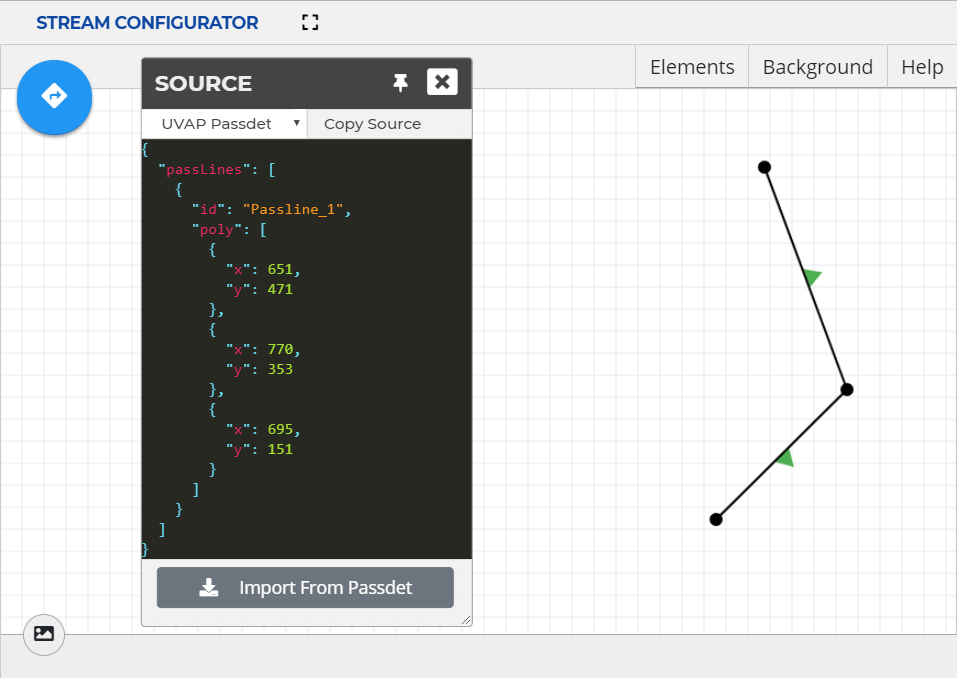

# Configuring Passlines

Configuring passlines in the Stream Configurator UI allows for quick and easy
passline creation and management.

For information on the Stream Configurator UI, see the [Stream Configurator UI Guide].

## Creating a New Passline

A passline is a chain of coordinates (joints). At least two joints are needed
to define a passline.

To create a passline:

>**Note:**  
Until the element is finished, any step can be undone with a **right-click**,
automatically jumping back to the previous action.  
This is also useful if the direction is defined but further joints have
 to be placed.

1. Enter **Passline** mode by selecting **Passline** in the new element
drop-down menu.
   
   

1. Start a passline with a **left-click** anywhere on the canvas to place its
   first joint.

1. Add a joint with a **left-click** anywhere on the canvas.  
   Any number of joints can be added to a passline.

1. Finish the line with a **double-click** on the last joint.
   Result: the application switches to the **Defining Entrance..** mode.

1. Define the entrance direction of the passline:

   >**Note:**  
   The entrance direction can be reversed later at any time.  
   For more information, see [Toggling Entrance Direction].   

   1. Click anywhere on the canvas to start the procedure.  
      A red arrow appears.
	  
   1. Cross the passline with the arrow.  
      If the passline is intersected, the arrow changes its color to blue.

   1. Finalize the entrance direction with a **left-click**.

   The passline is created. The arrows between the joints indicate the entrance
   direction.
   
1. Exit the **Passline** mode by clicking the passline icon.

>**Note:**  
Exiting **Passline** mode automatically completes unfinished elements.

  
***New Passline***

## Importing Passlines

**Stream Configurator** provides an import function, to make **Pass Detector**
configuration easier. From the **Pass Detector** configuration under
`ultinous.service.kafka.passdet.config`, the poly snippet can be copied and
imported into **Stream Configurator** for easier graphical management. For more
information on **Pass Detector** configuration, see [Configuring Pass Detector].
  
>**Attention!**  
For this feature to work as intended the Stream Configuration UI needs to
access the clipboard. Make sure clipboard access is not blocked by the browser.

To import a passline snippet:

1. Open the **Source** window.

1. Ensure that the format is set to `UVAP Passdet`. Select it from the drop-down
   menu if necessary.

1. From an external source — such as the **Pass Detector** configuration — copy
   a valid passline snippet configuration to the clipboard.

1. Select **Import From Passdet**. Approve clipboard access if the window pops up.  
Importing invalid configurations results in an error.

## Exporting Passlines

**Stream Configurator** provides an export function, to make **Pass Detector**
configuration easier. The created passline snippet can be copied to the
clipboard, then pasted into the **Pass Detector** configuration file
under `ultinous.service.kafka.passdet.config`. For more information on
**Pass Detector** configuration, see [Configuring Pass Detector].

To export a passline snippet:

1. Open the **Source** window.

1. Make sure that the format is set to `UVAP Passdet`. Select it from the dropdown
   menu if necessary.

1. Select **Copy Source**.
   The passline configuration is copied to the clipboard.

1. Paste the clipboard content into a the **Pass Detector** configuration
   file (as a value for `ultinous.service.kafka.passdet.config`) or to a
   separate file to store the passline configuration.

  
***Example Passline***

## Managing Existing Passlines

### Renaming a Passline

To rename a passline:

1. Open the **Elements** window.

1. Enter **Edit** mode by clicking the name of the passline.

1. Select **Rename Element**.
   The rename window pops up.

1. Type in the name of the passline.

1. Select **OK**.

1. Select **Save**.

### Removing a Passline

To remove a passline:

1. Open the **Elements** window.

1. Enter **Edit** mode by clicking the name of the passline.

1. Select **Delete**
   ()
   to delete the passline.

### Removing All Elements

To remove all elements:

>**Attention!**  
This option removes both passlines and detection filter areas!

1. Open the **Elements** window.

1. Select **Remove all**.
   A window pops up.

1. Select **OK**.

### Cloning a Passline

Cloning a passline creates a new object with the same joint coordinates
and with the same entrance direction. The joints and entrance direction can be
modified later. This feature is useful to create a passline with a
both-ways-active entrance.

To clone a passline:

1. Open the **Elements** window.

1. Enter **Edit** mode by clicking the name of the passline.

1. Select **Clone Object**.
   The Set Element Name window pops up.

1. Type in the name of the cloned passline.

1. Select **OK**.

1. Select **Save**.

### Hiding or Revealing a Passline

To hide or reveal a passline:

1. Open the **Elements** window.

1. Select **Toggle Visibility**
  ( or )
  for the passline to be hidden or revealed.
  
Additionally, **Toggle Visibility** can be clicked to reverse the visibility of
all elements.

### Toggling Entrance Direction

To toggle a Entrance Direction:

1. Open the **Elements** window.

1. Enter **Edit** mode by clicking the name of the passline.

1. Select **Toggle Direction**.

1. Select **Save**.

  
***Passline Elements Window***

### Adding a Joint

To add a passline joint:

1. Open the **Elements** window.

1. Enter **Edit** mode by clicking the name of the passline.

1. Click on the midpoint (direction indicator) to add a joint.

1. Select **Save**.

### Moving a Joint

To move a passline joint:

1. Open the **Elements** window.

1. Enter **Edit** mode by clicking the name of the passline.

1. **Left-drag** an existing joint to move it.

1. Select **Save**.

### Removing a Joint

To remove a passline joint:

1. Open the **Elements** window.

1. Enter **Edit** mode by clicking the name of the passline.

1. **Right-click** an existing joint to remove it.

1. Select **Save**.

[Configuring Pass Detector]: conf_passdet.md
[Stream Configurator UI Guide]: conf_sc_ui.md
[Toggling Entrance Direction]: #toggling-entrance-direction
