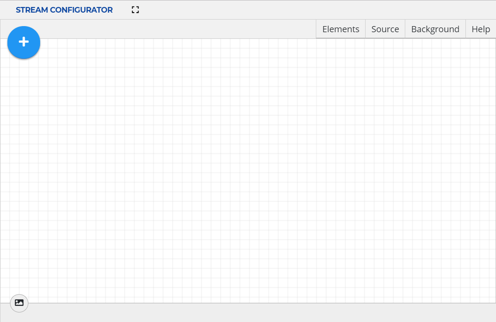

# Stream Configurator UI Guide

The Stream Configurator UI makes the generation and management of passlines and
detection filters quick and easy.

For information on setting up Stream Configurator UI, see [Starting Stream Configurator UI].

## Interface Elements

<a name="main_screen"></a>
  
***Main Screen of Stream Configurator***

The **Add New Elements** button
()
expands the drop-down menu.

**Detection Filter Area**
()
enters into **Detection Filter Area** mode for passline management. For
instructions, see [Configuring Detection Filter Areas].

**Passline**
()
enters into **Passline** mode for passline management. For
instructions, see [Configuring Passlines].

**Measure**
()
enters into the Measuring mode. **Left click** sets the starting point and displays the distance between the starting point and the cursor location. It also calculates the size and perimeter of the rectangle where the ruler is the diagonal.


**UVAP Image Stream** button
()
brings up the **UVAP Image Stream** module for UVAP input topic management.
For information, see [UVAP Image Stream].

## Interface Windows

**Elements** brings up the **Elements** window where all the objects
are listed. These can be managed as described in [Managing Existing Passlines]
or [Managing Existing Detection Filter Areas].

Passlines and Detection Filter Areas can be moved in edit mode by dragging the dashed outline of the currently selected element 
or by pressing the arrow keys.


**Source** brings up the **Source** window which is used for importing
and exporting passlines or detection filter areas. For further information, see [Importing Passlines],
[Exporting Passlines], [Importing Detection Filter Areas], and [Exporting Detection Filter Areas].

**Background** brings up the **Background**  window which can
be used for uploading background images, adjusting opacity and managing
gridlines. For further information, see [Adding Background Image].

In a window, the pin button
()
locks the window to the right sidebar. To unlock it again,
click on the unpin button
().

>**Note:**  
Only one window at a time can be locked to the right sidebar.

### Additional Functions

The **scroll wheel** zooms in and out of the canvas.

>**Note:**  
To set reset the zoom to default (100%), click on the zoom value in the header.

**Middle-mouse button + drag** moves the canvas. To reset to the center of the
canvas, click the **Go to Origin** button ().

**Stream Configurator** has the following keyboard shortcuts:

| Keyboard Shortcut | Function          |
| ----------------- | ----------------- |
| **Alt + B**       | Opens the **Background** window | 
| **Alt + E**       | Opens the **Elements** window | 
| **Alt + H**       | Opens the **Help** window | 
| **Alt + I**       | Opens the **UVAP Image Stream** toolbar | 
| **Alt + S**       | Opens the **Source** window | 
| **Alt + G**       | Toggles the grid visibility | 

## Adding Background Image

To add a background image:

1. Open the **Background** window.

1. Select **Upload Image**.

1. Select the image file to be uploaded.

1. Click **Open**.

>**Note**  
Removing or changing the uploaded image can be done through the **Background** window.

## UVAP Image Stream

**UVAP Image Stream** is a built in module of **Stream Configurator**
for displaying UVAP streams which makes passline configuration easier.

### Prerequisites

Ensure that the following components are started:

* [Zookeper]
* [MGR]
* [Web player]

See [Prerequisites in Starting Stream Configurator UI] for further information.

### Description

Selecting the UVAP Image Stream button
()
on the left navigation bar brings up the **UVAP Image Stream** toolbar:

>**Note:**  
The **Alt + I** keyboard shortcut also brings up the
**UVAP Image Stream** toolbar.
   
<a name="UVAP Image Stream"></a>
  
***UVAP Image Stream*** 

Where:

* **Topic** is an user defined input
  
  >**Note**  
  Make sure that the selected topic is started correctly.  
  Existing topics may appear as suggestions when topic input box is clicked.

To close the toolbar, click the UVAP Image Stream button again or the close button.

#### Live Footage Display

UVAP image stream can be used to display a live image stream.

* **Refresh** defines the update frequency of the stream:

  * `Automatic`: updates with every frame. The interval depends on the system.
  * `Manual`: only updates on user command.
  * `Interval (100 ms)`: updates based on the user-set interval rate (for 100 ms).
  * `Every nth frame`: updates based on the user-set frame rate.

* **Background Opacity** defines the transparency level of the stream on a `0-100` scale.

An icon next to the topic field indicates the status of the topic:
-  indicates the topic is not available.
-  indicates that the topic is loading.
-  indicates that the topic is online.

#### Historical Image Display


UVAP image player can be used to display a single frame from an image stream.  
**Timestamp** defines the timestamp of the frame to be displayed.

If there is no frame in the chosen topic with the requested timestamp, UVAP image
stream behaves the following way:

 * If the requested timestamp is smaller than the timestamp of the first frame in the stream,
 the first frame is displayed.
 * If the requested timestamp is larger than the timestamp of the last frame in the stream,
 the last frame is displayed.
 * Otherwise, the frame with the timestamp immediately after the
 specified timestamp is displayed (the frame with the closest timestamp that is
 bigger than the specified one).

An icon next to the topic field indicates the status of the topic:
-  indicates the image is not available.
-  indicates that the image is loading.
-  indicates that the image is online.

#### Disable Background 

Choose this option to remove video stream or uploaded image from background.

## Managing Elements

For further information on managing passlines and detection filters, see [Configuring Passlines]
and [Configuring Detection Filter Areas] respectively.

## Troubleshooting

### Closed Stream or Invalid Connection

#### Condition

An error indicator with the following message is displayed:

```
Selected stream is closed or connection invalid.
```

  
***Invalid Stream*** 

#### Cause

The connection is incorrect or the selected topic is invalid or not started
correctly. 

#### Solution

Check the connection and ensure that the topic is valid and started correctly.


[Adding Background Image]: #adding-background-image
[Configuring Passlines]: conf_passline_ui.md
[Configuring Detection Filter Areas]: conf_det_filter_ui.md
[Exporting Detection Filter Areas]: conf_det_filter_ui.md#exporting-detection-filter_areas
[Exporting Passlines]: conf_passline_ui.md#exporting-passlines
[Importing Detection Filter Areas]: conf_det_filter_ui.md#importing-detection-filter_areas
[Importing Passlines]: conf_passline_ui.md#importing-passlines
[Managing Existing Detection Filter Areas]: conf_det_filter_ui.md#managing-existing-detection-filter-areas
[Managing Existing Passlines]: conf_passline_ui.md#managing-existing-passlines
[MGR]: start_mgr.md
[Starting Stream Configurator UI]: start_sc_ui.md
[Prerequisites in Starting Stream Configurator UI]: start_sc_ui.md#prerequisites
[UVAP Image Stream]: #uvap-image-stream
[Web Player]: ../demo/demo_web_player.md
[Zookeper]: ../install/uvap_install_setup.md#starting-kafka
