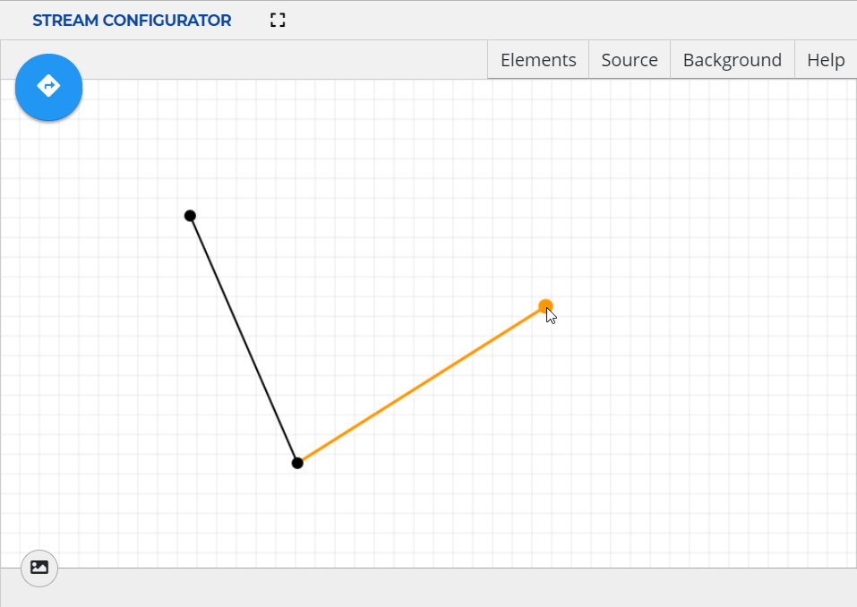
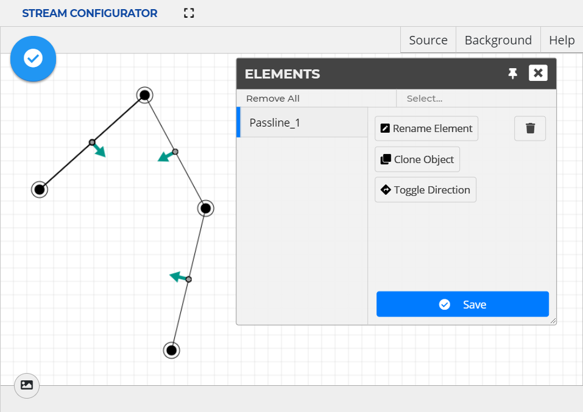

# Stream Configurator UI Guide

Configuring passlines in the Stream Configurator UI allows for quick and easy
passline creation and management.

For information on setting up Stream Configurator UI, see [Starting Stream Configurator UI].

## Interface Description

<a name="main_screen"></a>
  
***Main Screen of Stream Configurator***

The **menu** button
()
expands the left navigation bar.

**Passline**
()
enters into **Passline** mode for passline management. For
instructions, see [Passline Instructions].

**UVAP Image Stream** button
()
brings up the **UVAP Image Stream** module for UVAP input topic management.
For information, see [UVAP Image Stream].

**Elements** brings up the **Elements** window where all the objects
are listed. These can be managed as described in [Managing Existing Passlines].

**Source** brings up the **Source** window which is used for importing
and exporting passlines. For further information, see [Importing Passlines]
and [Exporting Passlines].

**Background** brings up the **Background**  window which can
be used for uploading background images, adjusting opacity and togglinng
gridlines. For further information, see [Adding Background Image].

In a window, the pin button
()
locks the window to the right sidebar. To unlock it again,
click on the unpin button
().

>**Note:**  
Only one window can be locked to the right sidebar.

### Additional Functions

The **scroll wheel** zooms in and out of the canvas.

>**Note:**  
To set reset the zoom to default (100%), click on the zoom value in the header.

**Middle-mouse button + drag** moves the canvas. To reset to the center of the
canvas, click the **Go to Origin** button.

**Stream Configurator** has the following keyboard shortcuts:

| Keyboard Shortcut | Function          |
| ----------------- | ----------------- |
| **Alt + B**       | Opens the **Background** window | 
| **Alt + E**       | Opens the **Elements** window | 
| **Alt + H**       | Opens the **Help** window | 
| **Alt + I**       | Opens the **UVAP Image Stream** toolbar | 
| **Alt + S**       | Opens the **Source** window | 

## Passline Instructions

### Creating a New Passline

A passline is a chain of coordinates (joints). At least two joints are needed
to define a passline.

To create a passline:

>**Note:**  
A step can be undone with a **right-click**, automatically jumping back
to the previous action.  
This is also useful if the direction is being given but further joints are
needed to be placed.

1. Enter **Passline** mode by selecting **Passline**
   () in the
   left navigation bar.

1. Start a passline with a **left-click** anywhere on the canvas to place its
   first joint.

1. Add a joint with a **left-click** anywhere on the canvas.  
   Any number of joint can be added to a passline.

1. Finish the line with a **double-click** on the last joint.
   Result: the application switches to the **Defining Entrance..** mode.

1. Define the entrance direction of the passline:

   >**Note:**  
   The entrace direction can be reversed anytime later.  
   For more information, see [Toggling Entrance Direction].   

   1. Click anywhere on the canvas to start the procedure.  
      A red arrow appears.
	  
   1. Cross the passline with the arrow.  
      If the passline is intersected, the arrow changes its color to blue.

   1. Finalize the entrance direction with a **double-click**.

   The passline is created. The arrows between the joints indicate the entrance
   direction.

<a name="new_passline"></a>
  
***New Passline***

### Importing Passlines

**Stream Configurator** provides an import function, to make **Pass Detector**
configuration easier. From the **Pass Detector** configuration under
`ultinous.service.kafka.passdet.config`, the passline JSON can be copied and
imported into **Stream Configurator** for easier graphical management. For more
information on **Pass Detector** configuration, see [Configuring Pass Detector].
  
>**Attention!**  
For this feature to work as intended the Stream Configuration UI needs to
access the clipboard. Make sure clipboard access is not blocled by the browser.

To import passline JSON:

1. Open the **Source** window.

1. Ensure that the format is set to `UVAP Passdet`. Select it from the dropdown
   menu if necessary.

1. From an external source — such as the **Pass Detector** configuration — copy
   a valid passline JSON configuration to the clipboard.

1. Select **Import From Passdet**. Approve clipboard access if the window pops up.


### Exporting Passlines

**Stream Configurator** provides an export function, to make **Pass Detector**
configuration easier. The created passline JSON can be copied to the
clipboard, then pasted into the **Pass Detector** configuration file
under `ultinous.service.kafka.passdet.config`. For more information on
**Pass Detector** configuration, see [Configuring Pass Detector].

To export passline JSON:

1. Open the **Source** window.

1. Ensure that the format is set to `UVAP Passdet`. Select it from the dropdown
   menu if necessary.

1. Select **Copy Source**.
   The passline configuration is copied to the clipboard.

1. Paste the clipboard content into a the **Pass Detector** configuration
   file (as a value for `ultinous.service.kafka.passdet.config`) or to a
   separate file to store the passline configuration.

<a name="example_passline"></a>
  
***Example Passline***

### Managing Existing Passlines

#### Renaming a Passline

To rename a passline:

1. Open the **Elements** window.

1. Enter **Edit** mode by clicking on the **Edit** button
   ()
   or **double-clicking** the name of the passline.

1. Select **Rename Element**.
   The rename window pops up.

1. Type in the name of the passline.

1. Select **OK**.

1. Select **Save**.

#### Removing a Passline

To remove a passline:

1. Open the **Elements** window.

1. Select **Delete**
   ()
   for the passline to be deleted.

#### Removing All Passlines

To remove all passlines:

1. Open the **Elements** window.

1. Select **Remove all**.
   A window pops up.

1. Select **OK**.

#### Cloning a Passline

Cloning a passline creates a new object with the same cooridnates for joints
and with the same entrance direction. The joints and entrance direction can be
modified after. This feature is useful to create a passline with a
both-ways-active entrance.

To clone a passline:

1. Open the **Elements** window.

1. Enter **Edit** mode by clicking on the **Edit** button
   ().

1. Select **Clone Object**.
   The Set Element Name window pops up.

1. Type in the name of the cloned passline.

1. Select **OK**.

1. Select **Save**.

#### Hiding or Revealing a Passline

To hide or reveal a passline:

1. Open the **Elements** window.

1. Select **Toggle Visibility**
  ( or )
  for the passline to be hidden or revealed.

#### Toggling Entrance Direction

To toggle a Entrance Direction:

1. Open the **Elements** window.

1. Enter **Edit** mode by clicking on the **Edit** button
   ()
   for the passline of which direction is to be changed.

1. Select **Toggle Direction**.

1. Select **Save**.

<a name="passline_elements"></a>
  
***Passline Elements Window***

#### Adding a Joint

To add a passline joint:

1. Open the **Elements** window.

1. Enter **Edit** mode by clicking on the **Edit** button
   ().

1. Click on the mindpoint (direction indicator) to add a joint.

1. Select **Save**.

#### Moving a Joint

To move a passline joint:

1. Open the **Elements** window.

1. Enter **Edit** mode by clicking on the **Edit** button
   ().

1. **Left-drag** an existing joint to move it.

1. Select **Save**.

#### Removing a Joint

To remove a passline joint:

1. Open the **Elements** window.

1. Enter **Edit** mode by clicking on the **Edit** button
   ().

1. **Right-click** an existing joint to remove it.

1. Select **Save**.

## Adding Background Image

To add a background image:

1. Open the **Background** window.

1. Select **Upload Image**.

1. Select the image file to be uploaded.

1. Click **Open**.

>**Note**  
Removing or changing the uploaded image can be done through the **Background** window.

## UVAP Image Stream

**UVAP Image Stream** is a built in module of **Stream Configurator**
for displaying UVAP streams which makes passline configuration easier.

### Prerequisites

Ensure that the following components are started:

* [Zookeper]
* [MGR]
* [Web player]

See [Prerequisites in Starting Stream Configurator UI] for further information.

### Description

Selecting the UVAP Image Stream button
()
on the left navigation bar brings up the **UVAP Image Stream** toolbar:

>**Note:**  
The **Alt + I** keyboard shortcut also brings up the
**UVAP Image Stream** toolbar.
   
<a name="UVAP Image Stream"></a>
  
***UVAP Image Stream*** 

Where:

* **Topic** is an user defined input
  
  >**Note**  
  Make sure that the selected topic is started correctly.  
  Existing topics may appear as suggestions when topic input box is clicked.

#### Live Footage Display

UVAP image stream can be used to display a live image stream.

* **Refresh** defines the update frequency of the stream:

  * `Automatic`: updates with every frame. The interval depends on the system.
  * `Manual`: only updates on user command.
  * `Interval (100 ms)`: updates based on the user-set interval rate (for 100 ms).
  * `Every nth frame`: updates based on the user-set frame rate.

* **Background Opacity** defines the transparency level of the stream on a `0-100` scale.

An icon next to the topic field insicates the status of the topic:
-  indicates the topic is not available.
-  indicates that the topic is loading.
-  indicates that the topic is online.

#### Historical Image Display


UVAP image player can be used to display a single frame from an image stream.  
**Timestamp** defines the timestamp of the frame to be displayed.

If there is no frame in the chosen topic with the requested timestamp, UVAP image
stream behaves the following way:

 * If the requested timestamp is smaller than the timestamp of the first frame in the stream,
 the first frame is displayed.
 * If the requested timestamp is larger than the timestamp of the last frame in the stream,
 the last frame is displayed.
 * Otherwise, the frame with the timestamp immediately after the
 specified timestamp is displayed (the frame with the closest timestamp that is
 bigger than the specified one).

An icon next to the topic field insicates the status of the topic:
-  indicates the image is not available.
-  indicates that the image is loading.
-  indicates that the image is online.

#### Disable Background 

Choose this option to remove video stream or uploaded image from background.

## Troubleshooting

### Invalid Configuration Import Input

#### Condition

During the passline configuration import procedure, when selecting
**Import From Passdet**, one of the following messages is displayed:

```
This config is not a valid JSON config.
1/3.: JSON parse
```

Or

```
This config does not matchthe required protobuf config.
2/3.: JSON scheme validator
```

#### Cause

The clipboard contains wrong input, for example an invalid JSON string.

#### Solution

Check if the input is correct in the clipboard. Only copy and import valid JSON
format.

### Closed Stream or Invalid Connection

#### Condition

An error indicator with the following message is displayed:

```
Selected stream is closed or connection invalid.
```

  
***Invalid Stream*** 

#### Cause

The connection is incorrect or the selected topic is invalid or not started
correctly. 

#### Solution

Check the connection and ensure that the topic is valid and started correctly.


[Adding Background Images]: #adding-background-images
[Configuring Pass Detector]: conf_passdet.md#configuring-pass-detector
[Exporting Passlines]: #exporting-passlines
[Importing Passlines]: #importing-passlines
[Kafka]: ../install/uvap_install_setup.md#starting-kafka
[Managing Existing Passlines]: #managing-existing-passlines
[MGR]: start_mgr.md
[Passline Instructions]: #passline-instructions
[Starting Stream Configurator UI]: start_sc_ui.md
[Prerequisites in Starting Stream Configurator UI]: start_sc_ui.md#prerequisites
[Toggling Entrance Direction]: #toggling-entrance-direction
[`ultinous.service.kafka.passdet.config`]: conf_passdet.md#ultinousservicekafkapassdetconfig
[UVAP Image Stream]: #uvap-image-stream
[Web Player]: ../demo/demo_web_player.md
[Zookeper]: ../install/uvap_install_setup.md#starting-kafka
