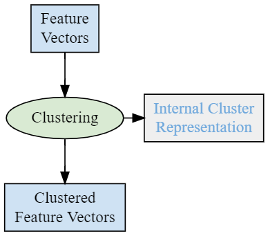

# Feature Vector Clustering

The **Feature Vector Clustering** microservice creates clusters of its input
feature vectors based on similarity.

The microservice implements various clustering algorithms. Its configuration determines which algorithm is in effect in a specific instance. The configuration consists
of a general and an algorithm-specific part.  

Clustering is based on a similarity measure between feature vectors and
clusters. Currently, only trivial algorithms are supported where a single feature vector represents a cluster. The representative feature vector can be the
last one belonging to this cluster, or an average of all previous ones.

  
***Clustering Process***  

The input of the microservice can be one or more topics containing feature 
vectors or feature vector clusters.
A feature vector cluster is represented by a `FeatureVector` field and the 
number of samples contributing to the cluster. A `FeatureVector` without 
any number of samples is interpreted as if the number of samples were 1.

The microservice maintains a single database for storing feature vector
clusters. The internal cluster representation can be algorithm-specific.
Stored feature vector clusters are first unrealized and may later become realized.
The conditions of realizing a cluster are determined by the Feature Vector 
Clustering configuration, see [Configuring Feature Vector Clustering].  
Registration events are generated for both realized and unrealized clusters 
with according value of the `is_realized` field.  

Each change to the database is optionally administered to a compacted
Kafka topic so that the database can be rebuilt from this topic at restart.
This method is an alternative to replaying input topics with a window of
retention period where data loss may occur in case of a fatal error.  
See [Save and Start from Internal State].  

Each registration stream can have an own retention period if configured so.
If a cluster is updated, its retention period becomes the maximum of its previous
retention period and the retention period set for the stream that is updating
the cluster.  

_Further reading:_

* [Configuring Feature Vector Clustering]

[Configuring Feature Vector Clustering]: conf_cluster.md
[Save and Start from Internal State]: func_save_start_from_int_state.md
