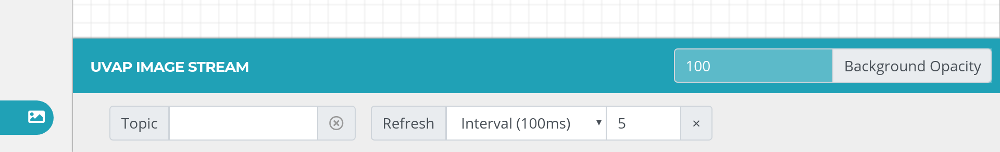

# Stream Configurator User Interface

**Stream Configurator** is an easy-to-use tool for
_pass line_ creation and management in UVAP.

Pass lines are directed polylines defined in the **Pass Detector** microservice
configuration (see [`ultinous.service.kafka.passdet.config`]). These lines help
detecting if an individual enters or leaves an area of interest.

>**Note:**  
**Stream Configurator** is optimized for Google Chrome™ browser.

## Setting Up Stream Configurator UI

To set up the Stream Configurator UI, run `configure.sh` in base mode.  
This runs the `generate_stream_configurator_ui.sh` script with default settings,
intended to work with the default UVAP configuration.

The UI can be built with a custom configuration by directly calling
`generate_stream_configurator_ui.sh`. Use the provided parameters to specify the
output location and the Docker image used for the process.

### Running configure.sh

>**Note:**  
For Stream Configurator UI to be built, the `-demo-mode` argument has to be set to `base`.

Building the UI this way results in the followings:
- The properties file is read from `../config`.
- The UI is generated to location `../ui`.
- The Docker image used to generate the UI is determined automatically by Git tags.

The following arguments provided to `configure.sh` can be used to configure the UI:

| Argument      | `--host-name`    |
| ------------- | ------------------------------------------------------ |
| Description   | Sets host name |
| Requirement   | Optional       |
| Default Value | `localhost`    |

| Argument      | `--web-player-port-number`    |
| ------------- | ------------------------------------------------------ |
| Description   | Sets port number |
| Requirement   | Optional       |
| Default Value | `9999`    |

### Running generate_stream_configurator_ui.sh

Stream Configurator UI can also be built by running `generate_stream_configurator_ui.sh`.

The following arguments can be provided:

| Argument      | `--output-ac-dir`    |
| ------------- | ------------------------------------------------------ |
| Description   | Target directory for UI generation|
| Requirement   | Optional       |
| Default Value | `current_dir/../ui`    |

| Argument      | `--config-ac-dir`    |
| ------------- | ------------------------------------------------------ |
| Description   | Properties file directory  |
| Requirement   | Optional       |
| Default Value | `current_dir/../config`   |

| Argument      | `--image-name`    |
| ------------- | ------------------------------------------------------ |
| Description   | Docker image generating the UI |
| Requirement   | Optional       |
| Default Value | Determined by Docker tags    |

## Starting Stream Configurator UI

### Prerequisites
To be able to display the video stream and topics, make sure the following
components are up and running:

>**Note**  
It is important that the components are started up in this order.

- [Kafka]
- [Zookeper]
- [MGR]
- [Web Player]


### Starting the UI
Stream Configurator UI can be started by opening `{UVAP_HOME}/ui/uvap_stream_configurator_ui/index.html`
in a web browser. Only Google Chrome™ version 76 and later is supported.

## Interface Description

<a name="main_screen"></a>
  
***Main Screen of Stream Configurator*** 

The **menu** button
()
expands the left navigation bar.

**Passline**
()
enters into **Passline** mode for pass line management. For
instructions, see [Pass Line Instructions].

**UVAP Image Stream** button
()
brings up the **UVAP Image Stream** module for UVAP input topic management.
For information, see [UVAP Image Stream].

**Elements** brings up the **Elements** window where all the objects
are listed. These can be managed as described in [Managing Existing Pass Lines].

**Source** brings up the **Source** window which is used for importing
and exporting pass lines. For further information, see [Importing Pass Lines]
and [Exporting Pass Lines].

In a window, the pin button
()
locks the window to the right sidebar. To unlock it again,
click on the unpin button
().

>**Note:**  
Only one window can be locked to the right sidebar.

### Additional Functions

The **scroll wheel** zooms in and out of the canvas.

>**Note:**  
To set reset the zoom to default (100%), click on the zoom value in the header.

**Ctrl + left-drag** moves the canvas.


**Stream Configurator** has the following keyboard shortcuts:

| Keyboard Shortcut | Function          |
| ----------------- | ----------------- |
| **Alt + I**       | UVAP Image Stream | 

## Pass Line Instructions

### Creating a New Pass Line

A pass line is a chain of coordinates (joints). At least two joints are needed
to define a pass line.

To create a pass line:

>**Note:**  
A step can be undone with a **right-click**, automatically jumping back
to the previous action.  
This is also useful if the direction is being given but further joints are
needed to be placed.

1. Enter **Passline** mode by selecting **Passline**
   () in the
   left navigation bar.

1. Start a pass line with a **left-click** anywhere on the canvas to place its
   first joint.

1. Add a joint with a **left-click** anywhere on the canvas.  
   Any number of joint can be added to a pass line.

1. Finish the line with a **double-click** on the last joint.
   Result: the application switches to the **Defining Entrance..** mode.

1. Define the entrance direction of the passline:

   >**Note:**  
   The entrace direction can be reversed anytime later.  
   For more information, see [Toggling Entrance Direction].   

   1. Click anywhere on the canvas to start the procedure.  
      A red arrow appears.
	  
   1. Cross the pass line with the arrow.  
      If the pass line is intersected, the arrow changes its color to blue.

   1. Finalize the entrance direction with a **double-click**.

   The passline is created. The arrows between the joints indicate the entrance
   direction.

### Importing Pass Lines

**Stream Configurator** provides an import function, to make **Pass Detector**
configuration easier. From the **Pass Detector** configuration under
`ultinous.service.kafka.passdet.config`, the pass line JSON can be copied and
imported into **Stream Configurator** for easier graphical management. For more
information on **Pass Detector** configuration, see [Configuring Pass Detector].

To import pass line JSON:

1. Open the **Source** window.

1. Ensure that the format is set to `UVAP Passdet`. Select it from the dropdown
   menu if necessary.

1. From an external source — such as the **Pass Detector** configuration — copy
   a valid pass line JSON configuration to the clipboard.

1. Select **Import From Passdet**.

### Exporting Pass Lines

**Stream Configurator** provides an export function, to make **Pass Detector**
configuration easier. The created pass line JSON can be copied to the
clipboard, then pasted into the **Pass Detector** configuration file
under `ultinous.service.kafka.passdet.config`. For more information on
**Pass Detector** configuration, see [Configuring Pass Detector].

To export pass line JSON:

1. Open the **Source** window.

1. Ensure that the format is set to `UVAP Passdet`. Select it from the dropdown
   menu if necessary.

1. Select **Copy Source**.
   The pass line configuration is copied to the clipboard.

1. Paste the clipboard content into a the **Pass Detector** configuration
   file (as a value for `ultinous.service.kafka.passdet.config`) or to a
   separate file to store the pass line configuration.  

### Managing Existing Pass Lines

#### Renaming a Pass Line

To rename a pass line:

1. Open the **Elements** window.

1. Enter **Edit** mode by clicking on the **Edit** button
   ()
   for the pass line to be renamed.

1. Select **Rename Element**.
   The rename window pops up.

1. Type in the name of the pass line.

1. Select **OK**.

1. Select **Save**.

#### Removing a Pass Line

To remove a pass line:

1. Open the **Elements** window.

1. Select **Delete**
   ()
   for the pass line to be deleted.

#### Removing All Pass Lines

To remove all pass lines:

1. Open the **Elements** window.

1. Select **Remove all**.
   A window pops up.

1. Select **OK**.

#### Cloning a Pass Line

Cloning a pass line creates a new object with the same cooridnates for joints
and with the same entrance direction. The joints and entrance direction can be
modified after. This feature is useful to create a pass line with a
both-ways-active entrance.

To clone a pass line:

1. Open the **Elements** window.

1. Enter **Edit** mode by clicking on the **Edit** button
   ()
   for the pass line to be renamed.

1. Select **Clone Object**.
   A window pops up.

1. Type in the name of the cloned pass line.

1. Select **OK**.

1. Select **Save**.

#### Hiding a Pass Line

To hide a pass line:

1. Open the **Elements** window.

1. Select **Toggle Visibility**
  ()
  for the pass line to be hidden.

#### Revealing a Pass Line

To reveal a hidden a pass line:

1. Open the **Elements** window.

1. Select **Toggle Visibility**
  ()
  for the pass line to be revealed.

#### Toggling Entrance Direction

To rename a pass line:

1. Open the **Elements** window.

1. Enter **Edit** mode by clicking on the **Edit** button
   ()
   for the pass line of which direction is to be changed.

1. Select **Toggle Direction**.
   The rename window pops up.

1. Select **Save**.

#### Adding a Joint

To add a joint to a passline:

1. Open the **Elements** window.

1. Enter **Edit** mode by clicking on the **Edit** button
   ()
   for the pass line to be renamed.

1. Click on the mindpoint (direction indicator) to add a joint.

1. Select **Save**.

#### Moving a Joint

To move a joint of a passline:

1. Open the **Elements** window.

1. Enter **Edit** mode by clicking on the **Edit** button
   ()
   for the pass line to be renamed.

1. Move an existing joint with **left-drag**.

1. Select **Save**.

#### Removing a Joint

To remove a joint of a passline:

1. Open the **Elements** window.

1. Enter **Edit** mode by clicking on the **Edit** button
   ()
   for the pass line to be renamed.

1. Remove an existing joint with a **right-click**.

1. Select **Save**.

## UVAP Image Stream

**UVAP Image Stream** is a built in module of **Stream Configurator**
for displaying UVAP streams which makes pass line configuration easier.

### Prerequisites

Ensure that the following components are started:

* Zookeper
* UVAP
* **Multi-Graph Runner (MGR)** microservice
* Web player

To start the components:

1. Start Zookeper:

   ```
   docker run --net=uvap -d --name=zookeeper \
     -e ZOOKEEPER_CLIENT_PORT=2181 confluentinc/cp-zookeeper:4.1.0
   ```

2. Start UVAP:

   ```
   docker run --net=uvap -d -p 9092:9092 --name=kafka \
     -e KAFKA_ZOOKEEPER_CONNECT=zookeeper:2181 \
     -e KAFKA_ADVERTISED_LISTENERS=PLAINTEXT://kafka:9092 \
     -e KAFKA_OFFSETS_TOPIC_REPLICATION_FACTOR=1 \
     -e KAFKA_MESSAGE_MAX_BYTES=10485760 \
     -e ZOOKEEPER_CLIENT_PORT=2181 confluentinc/cp-kafka:4.1.0
   ```

3. Start **MGR**:

   ```
   "${UVAP_HOME}"/scripts/run_mgr.sh -- --net=uvap
   ```

4. Start Web player:

   ```
   "${UVAP_HOME}"/scripts/run_uvap_web_player.sh -- --net uvap
   ```

### Description

Selecting the UVAP Image Stream button
()
on the left navigation bar brings up the **UVAP Image Stream** window:

>**Note:**  
The **Alt + I** keyboard shortcut also brings up the
**UVAP Image Stream** window.
   
<a name="UVAP Image Stream"></a>
  
***UVAP Image Stream*** 

Where:

* **Topic** is an user defined input
  
  >**Note**  
  Ensure that the selected topic is started correctly.


* **Refresh** defines the update frequency of the stream:

  * `Automatic`: updates with every frame. The interval depends on the system.
  * `Manual`: only updates on user command.
  * `Interval (100 ms)`: updates based on the user-set interval rate (for 100 ms).
  * `Every nth frame`: updates based on the user-set frame rate.

* **Opcaity** defines the transparency level of the stream on a `0-100` scale.

## Troubleshooting

### Invalid Configuration Import Input

#### Condition

During the pass line configuration import procedure, when selecting
**Import From Passdet**, one of the following messages is displayed:

```
This config is not a valid JSON config.
1/3.: JSON parse
```

```
This config does not matchthe required protobuf config.
2/3.: JSON scheme validator
```

#### Cause

The clipboard contains wrong input, for example an invalid JSON string.

#### Solution

Check if the input is correct in the clipboard. Only copy and import valid JSON
format.


### Closed Stream or Invalid Connection

#### Condition

An error indicator with the following message is displayed:

```
Selected stream is closed or connection invalid.
```

 

#### Cause

The connection is incorrect or the selected topic is invalid or not started
correctly. 

#### Solution

Check the connection and ensure that the topic is valid and started correctly.


[Configuring Pass Detector]: conf_passdet.md#configuring-pass-detector
[Exporting Pass Lines]: #exporting-pass-lines
[Importing Pass Lines]: #importing-pass-lines
[Kafka]: ../install/uvap_install_setup.md#starting-kafka
[Managing Existing Pass Lines]: #managing-existing-pass-lines
[MGR]: start_mgr.md
[Pass Line Instructions]: #pass-line-instructions
[Toggling Entrance Direction]: #toggling-entrance-direction
[`ultinous.service.kafka.passdet.config`]: conf_passdet.md#ultinousservicekafkapassdetconfig
[UVAP Image Stream]: #uvap-image-stream
[Web Player]: ../demo/demo_web_player.md
[Zookeper]: ../install/uvap_install_setup.md#starting-kafka