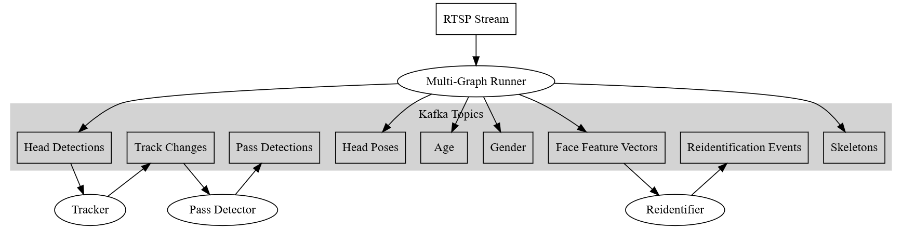

# Data Model

As shown below, microservices are connected through Kafka® topics. This
section provides information about the schema and format of these topics.



The data model of UVAP is normalized. Every topic contains one piece of
information; if information from multiple topics is needed, the topics
have to be joined.

## Topic Naming Convention

Kafka topics cannot be structured to hierarchical folders, so UVAP packages most
information into the topic name to help the users. Topic names use the following
naming convention:

   ```
   <domain>.cam.<stream_id>.<data_name>.<schema>.<serialization_format>
   ```

Where:

| Variable                 | Description 
| ------------------------ | -----------
| `<domain>`               | User-defined prefix. Can be used to distinguish between topics in different projects, locations, and so on.
| `<stream_id>`            | ID of the stream. Can be used to distinguish between topics for different cameras.
| `<data_name>`            | Name of the input data. Can be used to distinguish between different instances of analysis type.
| `<schema>`               | Record schema name. For further information, see [Topic Schemas] below.
| `<serialization_format>` | Format of the topic file. Currently only JSON (`.json`) is supported for structured data. JPEG (`.jpeg`) is used to save images.

> **Attention!**  
Uncompressed JSON can be prohibitive. It is recommended to turn on LZ4
compression in the Kafka broker to spare storage and bandwidth.

Although this naming convention is recommended, the topic name is completely
user-defined.

#### Example Topic Name

See the following example topic name and its description below:

   ```
   demo.cam.117.dets.ObjectDetectionRecord.json
   ```

This topic is produced by **MGR**, `dets` refers to the **MGR** data node.

`ObjectDetectionRecord` refers to the schema of the data described
in the [Kafka data proto].

`.json` describes the serialization format.

## Topic Schemas

The data model used by UVAP is normalized. The schema of all the structured
topics are described in the [Kafka data proto] with comments embedded for
explanation. The schema of the Kafka record values are defined in proto
messages ending with `Record`. The comment before the definition describes
the key as well.

Microservices emit progress (or heartbeat) records as well to make joining topics
easier in real-time. Different topics have different progress record
properties, which are described in the [Kafka data proto].

#### Example Topic Schema

See the following example topic schema (`ObjectDetectionRecord`):

```
// Detection record.
// One instance of this record is generated for each detected head/face on each frame.
//
// time: timestamp of the input video frame
// key: time + "_" + sequential index within frame
message ObjectDetectionRecord
{
  ObjectType type = 1;            // Object type
  Rect bounding_box = 2;          // Rectangular box containing the object (eg.: head/face)
  float detection_confidence = 3; // Detection confidence between 0 and 1
  bool end_of_frame = 4;          // When true, all other fields of the record are invalid.
}
```

#### Example Output Records

See the following example dump of a JSON detection topic with the
`ObjectDetectionRecord` schema:

```
$ kafkacat -C -b localhost -t demo.dets.ObjectDetectionRecord.json -o-1 -f "%k,%s\n"
1561981650053,{"type":"PERSON_HEAD","detection_confidence":0,"end_of_frame":true}
1561981650303_0,{"type":"PERSON_HEAD","bounding_box":{"x":1009,"y":388,"width":44,"height":52},"detection_confidence":0.978241444,"end_of_frame":false}
1561981650303_1,{"type":"PERSON_HEAD","bounding_box":{"x":1235,"y":434,"width":68,"height":80},"detection_confidence":0.924045682,"end_of_frame":false}
1561981650303,{"type":"PERSON_HEAD","detection_confidence":0,"end_of_frame":true}
1561981650553_0,{"type":"PERSON_HEAD","bounding_box":{"x":1009,"y":388,"width":44,"height":52},"detection_confidence":0.978059471,"end_of_frame":false}
1561981650553_1,{"type":"PERSON_HEAD","bounding_box":{"x":1236,"y":435,"width":67,"height":79},"detection_confidence":0.928204656,"end_of_frame":false}
1561981650553,{"type":"PERSON_HEAD","detection_confidence":0,"end_of_frame":true}
1561981650803,{"type":"PERSON_HEAD","detection_confidence":0,"end_of_frame":true}
1561981651003,{"type":"PERSON_HEAD","detection_confidence":0,"end_of_frame":true}
```

There are timestamps (for example: `1561981650803`) with no detections, only
a record with `end_of_frame` set to `true`.

If the `end_of_frame` has the value `true` when processing detections, the
microservice can emit all the information for the particular frame.

## Cross References

Records in topics produced by a microservice often contain references to records
of other topics. A chain of references ensures the possibility to link useful
data with each other, for example, demographic data with tracks.

#### Example Cross Reference

The `detection_key` property of `TrackChangeRecord` produced by the **Tracker**
microservice refers to an `ObjectDetectionRecord` key and an `AgeRecord` key in
two other topics produced by **MGR**. For more information on these keys, see
[Kafka data proto].

> **Note:**  
The key in `TrackChangeRecord` is usually not equal to its
`detection_key`, for its key refers to the detection of the first record of the
track. For further information, see [Tracker Record Schemas].

This simple example is only a sneak peek of UVAP capabilities. For example,
with **Pass Detection** microservice, even more information can be received
about a `TrackChangeRecord` (which can be associated with `AgeRecords`).

## Consuming and Producing messages

While using UVAP it is possible to read the result topics of a particular microservice
with your own code or to write custom messages, for example when creating your own staff directory using [Person Streams].
A [Python implementation of a simple low- and high level Consumer and Producer] is also provided as a part of the
package. For more details, see the [Demo Applications].

## Join

Because the data model is normalized, it is common to read and join multiple
topics. Joining Kafka topics is solved in the **Kafka Streams** Java API.
A [Python implementation of Join] is also provided as a part of the
package. For more details, see the [Demo Applications].

[Python implementation of Join]: ../../demo_applications/utils/kafka/time_ordered_generator_with_timeout.py
[Kafka data proto]: ../../proto_files/ultinous/proto/common/kafka_data.proto
[Tracker]: conf_track.md
[Tracker Record Schemas]: conf_track.md#record-schemas
[Topic Schemas]: #topic-schemas
[Person Streams]: ms_reid.md#person-stream
[Python implementation of a simple low- and high level Consumer and Producer]: ../../demo_applications/utils/kafka/kafka-cli.py
[Demo Applications]: ../demo/demo_overview.md
