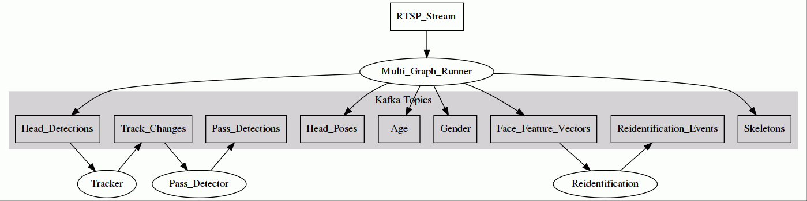

# Overview

## What is UVAP?

Ultinous Video Analysis Platform (UVAP) is a set of software services that can be composed and extended in a flexible way to build scaleable, distributed **video processing applications** in multiple domains such as **retail**, **security** or **elderly care**.

## Video analysis capabilities

UVAP provides a rich set of **deep learning based advanced video analysis** models. These models are industry leading in accuracy along with efficient processing. The available core models are:

- head/face detection
- 3D head pose
- face recognition, re-identification
- full body re-identification
- age
- gender
- human body pose
- tracking
- pass detection, counting

##  Example use cases

UVAP has been used to solve real world problems in different domains. Some examples:

- Queue management system for retail stores. Customers are counted at the doors and in the queuing area in real-time. A prediction model can tell if there will be a queue in the next few minutes and staff is alerted before it happens.

- Fall detection in elderly care homes. The system uses two 3D calibrated cameras per room and runs human body pose estimation. Based on the body pose fallen body pose can be recognized. An alert is sent to the staff in real-time. Staff personals can look at the alert, validate the images and decide to take action.

- Measure waiting time on Airports. Face recognition is applied at the entrance and exit points in real-time to measure actual waiting time. Prediction is applied and displayed to customers entering the queue.

- Recognize unsafe escalator usage. Based on head detection, tracking and full body pose different unsafe situations are recognized such as: wrong direction, leaning out, crowd.

# Architecture

UVAP implements a **dataflow programming model** where the data is processed by multiple simple processors (potentially running on different hosts) connected by channels. This model is widely used in the video processing domain for example in [ffmpeg](https://ffmpeg.org) or [gstreamer](https://gstreamer.freedesktop.org). UVAP uses [Apache Kafka](https://kafka.apache.org) for data channels and [Docker](https://www.docker.com) to run the processors. These technologies provides a generic and flexible framework to build stream processing applications.

The **microservice** term is used in the rest of the document for processors. The main use case of UVAP is real-time video analysis where all processors run continuously processing potentially never ending data. A microservice can take zero or more kafka topics as input and produce zero or more kafka topics as output. In kafka terminology they are consumers, producers or stream processors. Microservices are packaged and run as docker containers. Microservices typically process data in real-time, however it is possible to run them on historical data.

The data channels between microservices are **Kafka topics**. Head of the topics are kept in persistent storage for configurable time or size. For example the user can configure to keep the last two weeks of video data and keep all object detentions for a year.


*Fugire 1. Data flow architecture of UVAP. Rectangles are data channels, ellipses are processing units.*

[Multi graph runner (MGR)](microservices/mgr/mgr.md) takes the video streams and runs all deep learning based image processing models (eg.: head detection, face recognition). [MGR](microservices/mgr/mgr.md) outputs only lightweight data such as head detection streams or face recognition feature vectors. **It is very important the uncompressed video data never transfered over kafka, all low level image processing is done inside [MGR](microservices/mgr/mgr.md).** Kafka is only used to exchange lightweight data.

# Data model
As shown in *Figure 1.* the microservices are connected via kafka topics. This section provides information about the schema and format of these topics.

**The data model of UVAP is normalized.** Every topic contains one piece of information, **if the user needs information from multiple topics the topics have to be joined**.

## Topic naming convention

Kafka topics cannot be structured to hierarchical folders so UVAP package a lot of information into the topic name to help the users. Topic names follow a simple naming convention:
```
<domain>.cam.<stream_id>.<data_name>.<schema>.<serialization_format>
```

Let's take an example:

```
demo.cam.117.dets.ObjectDetectionRecord.json
```

This topic is produced by MGR, `dets` here refers to the MGR data node. `ObjectDetectionRecord` refers to the schema of the data, it is described in the [data model](../../proto_files/ultinous/proto/common/kafka_data.proto).

`json` describes the serialization format. Currently only json is supported for structured data. It is recommended to turn lz4 compression on in the kafka broker to spare storage and bandwidth as uncompressed json can be prohibitive.

## Topic schemas

As mentioned above the data model is **normalized**. The schema of all the structured topics are described [here](../../proto_files/ultinous/proto/common/kafka_data.proto) with comments embedded for explanation. The schema of the value part of the kafka records are defined in proto messages ending with ```Record```. The comment before the definition describes the key as well. Example:

```
// Detection record.
// One instance of this record is generated for each detected head/face on each frame.
//
// time: timestamp of the input video frame
// key: time + "_" + sequential index within frame
message ObjectDetectionRecord
{
  ObjectType type = 1;            // Object type
  Rect bounding_box = 2;          // Rectangular box containing the object (eg.: head/face)
  float detection_confidence = 3; // Detection confidence between 0 and 1
  bool end_of_frame = 4;          // When true, all other fields of the record are invalid.
}
```

Example dump of json detection topic with this schema:

```
$ kafkacat -C -b localhost -t demo.dets.ObjectDetectionRecord.json -o-1 -f "%k,%s\n"
1561981650053,{"type":"PERSON_HEAD","detection_confidence":0,"end_of_frame":true}
1561981650303_0,{"type":"PERSON_HEAD","bounding_box":{"x":1009,"y":388,"width":44,"height":52},"detection_confidence":0.978241444,"end_of_frame":false}
1561981650303_1,{"type":"PERSON_HEAD","bounding_box":{"x":1235,"y":434,"width":68,"height":80},"detection_confidence":0.924045682,"end_of_frame":false}
1561981650303,{"type":"PERSON_HEAD","detection_confidence":0,"end_of_frame":true}
1561981650553_0,{"type":"PERSON_HEAD","bounding_box":{"x":1009,"y":388,"width":44,"height":52},"detection_confidence":0.978059471,"end_of_frame":false}
1561981650553_1,{"type":"PERSON_HEAD","bounding_box":{"x":1236,"y":435,"width":67,"height":79},"detection_confidence":0.928204656,"end_of_frame":false}
1561981650553,{"type":"PERSON_HEAD","detection_confidence":0,"end_of_frame":true}
1561981650803,{"type":"PERSON_HEAD","detection_confidence":0,"end_of_frame":true}
1561981651003,{"type":"PERSON_HEAD","detection_confidence":0,"end_of_frame":true}
```

## Technical progress records

Note that in the example there are timestamps (eg.:`1561981650803`) with no detections only a record with `end_of_frame` set to `true`. In general all microservices emit  progress (or heartbeat) records to make joining these topics easier in real-time. (If the `end_of_frame` received the microservice can emit all the information for the particular frame.)

## Join
As the data model is normalized it is common to read and join multiple topics. Joining kafka topics is solved in the java kafka streams API. We also provide a [python implementation](../../demo_applications/utils/kafka/time_ordered_generator_with_timeout.py) as part of the package, see the demo applications for more details.

# Microservices

## [Multi graph runner (MGR)](microservices/mgr/mgr.md)

Future versions of UVAP will contain many more microservices such as tracking and reidentification.

# Tutorial
Comming soon...

# Extending UVAP
Comming soon...
