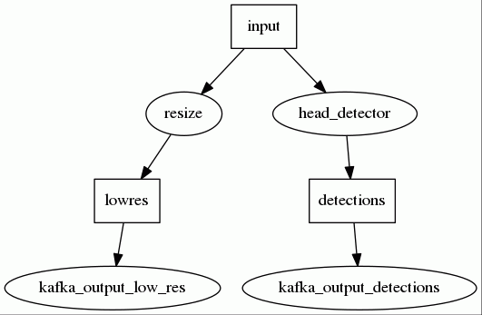

# Multi Graph Runner (MGR)

## Introduction

MGR takes the video streams and runs **image processing algorithm** and outputs lightweight data streams such as detection stream, or face feature vector stream.
MGR has many built-in image processing algorithms that can be combined in a flexible way to produce the desired output. There are two types of algorithms:
 - Deep learning models (e.g. face detection, face recognition, full body pose...)
 - Traditional image processing algorithms (e.g. image resize, image rotation, cropping, drawing...)

Output of MGR is typically lightweight data streams written to Kafka, however MGR can also produce image sequences or video streams for debugging or presentation purposes **but these always have to be compressed before it hits kafka**. Kafka cannot handle uncompressed video streams since their bandwidth is typically close to or over disk and network I/O limits. Modern video compression algorithms such as H264 has a compression ratio better than 1:100.

MGR uses Nvidia GPUs to do most of the data processing. One MGR instance can process multiple video streams real-time. One MGR can handle only one GPU so **for each GPU a separate MGR instance has to run**.

## Configuration

To configure an MGR instance one needs to specify how to combine the different algorithms. **MGR can be configured with a dataflow graph.** The MGR's data flow is a directed [bipartite graph](https://en.wikipedia.org/wiki/Bipartite_graph) consisting of **data nodes** and **process nodes**.

This model is very similar to the UVAP dataflow, one could ask why two data flow models are needed? MGR deals with very high bit rate data: uncompressed video streams. This data cannot be transfered over Kafka due to the I/O and network limitations. MGR deals with all the low level image processing algorithms while the rest of the microservices deal with lightweight higher level data.

Another significant difference is that the **MGR dataflow is synchronized**: all the processing nodes (within one data_run, see later) gets called exactly once for each input frame in dependency order.

### Config file format

The dataflow config is text file following the [proto text](https://developers.google.com/protocol-buffers/docs/overview) format. It is a simple structured format best can be understood from an example (see more examples below). Formal definition of the config file is given in [this proto file](../../../../proto_files/ultinous/proto/dataflow/dataflow_pub.proto). **Notice that proto and prototxt are two different formats!** Prototxt is used to configure MGR while [proto](https://developers.google.com/protocol-buffers/docs/proto) is used to formally define what are the possible configuration options. Let's see an example. We can specify  a region of interest cropping (ROI) process node in the following config part (prototxt):
```
...
# comment is hash mark in prototxt
process_node {
  type: ROI
  name: "roi1"
  roi_config {
    input: "input"
    output: "roi1"
    x: 400
    y: 200
    width: 400
    height: 400
  }
}
...
```
And the corresponding parts of the formal [proto](https://developers.google.com/protocol-buffers/docs/proto) definition (`...` is used to substitute for missing parts):
```
message DataFlowGraphConfig {
  ...
  repeated ProcessNodeConfig process_node = 3; // the process nodes
  ...
}

...
message ProcessNodeConfig {
  enum Type {
    ...
    ROI = 2;
    ...
  }

  required Type type = 1;
  required string name = 2;
  ...
  optional ROIConfig roi_config = 6;
  ...
}
...
message ROIConfig {
  required string output = 2; // output FRAME

  required int32 x = 3; // x coordinate of the top left corner in pixels
  required int32 y = 4; // y coordinate of the top left corner in pixels
  required int32 width = 5; // in pixels
  required int32 height = 6; // in pixels
}
...
```
Let's see a full example dataflow configuration file. This simply reads the webcam camera stream, runs head detector on every second frame and writes the detection results to a kafka stream. This is the graph itself, comments for better understanding are embedded:

```
# load the necessary engines (set of models that will be used)
engines_file: "/opt/ultinous/models/engines/head_det.prototxt"

environment:
{
  debug_level: 4
  profile: false
  analysis_thread_count: 2  # 2 is a good number for most of the cases
  gui: NONE                 # can be set to NORMAL for debug purposes
  drop_on: {}               # drop frames if the processing cannot keep up with real-time
  kafka_broker_list: "localhost:9092"
}

# a data run for the webcam stream (there can be multiple data runs)
data_run:
{
  input:
  {
    file_name: "/dev/video0"  # input is device 0, typically the webcam
    drop_rate: 2   # process only every second frame
  }

  data_flow:
  {
    data_node: {type: FRAME name: "input"}      # always have to have the input frame
    data_node: {type: DETECTIONS name: "detections"}

    # the head detector
    process_node:
    {
      type: OBJ_DETECTOR
      name: "head_detector"
      logging: false
      obj_det_config:
      {
        type: HEAD
        input: "input"              # connect to the input data node
        bounding_boxes: "detections"
        min_height_in_pixels: 16
        max_height_in_pixels: 256
        confidence_threshold: 0.95  # look for high confidence detections
        image_scale_factor: 0.5     # downscale image by a factor of 2
      }
    }

    # write detections to a kafka stream
    process_node:
    {
      type: KAFKA_OUTPUT
      name: "kafka_output_detections"
      kafka_output_config:
      {
        topic_name: "demo.cam.0.dets.ObjectDetectionRecord.json"
        input_node: "detections"    # connect to the detections data node
      }
    }
  }
}
```

Process nodes are connected via data nodes. We can visualize data dataflow as a graph, see graph below (process nodes are ellipses, data nodes are rectangles).



The ```data_flow``` section describes the dataflow itself. **First we need to list all data nodes.** After that comes the list of process nodes. **Process nodes will be executed in the order of listing.** Process nodes refers to input and output data nodes in their configuration.

For very detailed configurations options look at the [this proto file](../../../../proto_files/ultinous/proto/dataflow/dataflow_pub.proto). Comments are embedded to the proto for explanation.

[This](graph_examples/full.prototxt) is a more complex dataflow involving two cameras and most of the deep learning models.

## Deployment

To run MGR the server must have an nvidia GPU (1060 with 6G GPU memory or better). MGR has to be executed with nvidia-docker. If the server has more GPUs, a separate MGR instance should run on each GPU for optimal performance.

## Runtime performance

One MGR instance can process multiple video streams but the load of the system has to be carefully calculated. If the MGR has more tasks than it is able to handle, it can throw away input frames without processing or it can queue them. This can be controlled with the drop mode in the ```environment``` section:
```
environment:
{
  debug_level: 4
  profile: true
  analysis_thread_count: 2
  gui: NORMAL
  drop_off: {}    # do not drop frames, instead queue them up
  #drop_on: {}    # if the system gets overloaded drop frames
  kafka_broker_list: "localhost:9092"
}
```

We recommend to use the `nvidia-smi` tool to monitor GPU load.

Runtime performance depends on a lot of factors but these are the most expensive operations:

 - Running deep learning models
 - Encoding video
 - Decoding video

### Detector

The first deep learning model is typically a detector (e.g.: head detector). This is one of the most expensive operations. Cost of the detector is a complex function but these are the most important factors:

 - FPS: cost of the detector is linear with the frame rate. If the system is overloaded one of the easiest way to decrease is to decrease the frame rate. It can be done on the camera or by using the ```drop_rate``` parameter (see above)
 - Resolution: cost of the detector is linear with the number of pixels (quadratic with the image size!). Use the ```scaling_factor``` parameter of the detector to control the resolution. Halving the ```scaling_factor``` decreases the cost of the detector four times!

### Skeleton

Skeleton models has the same cost characteristics as the detector. It does not support scale factor (it rescales the input image to a fixed resolution). FPS is the only option to control the load of this model.

### Other models

Cost of head pose, face recognition, demographics are all linear with the number of crops. The load can be very different in crowded environments. TODO: use object filter to limit the number of crops.

### Saving video
Saving video always involves video encoding which is a computation heavy operation.
TODO: write to avi, write to kafka.
