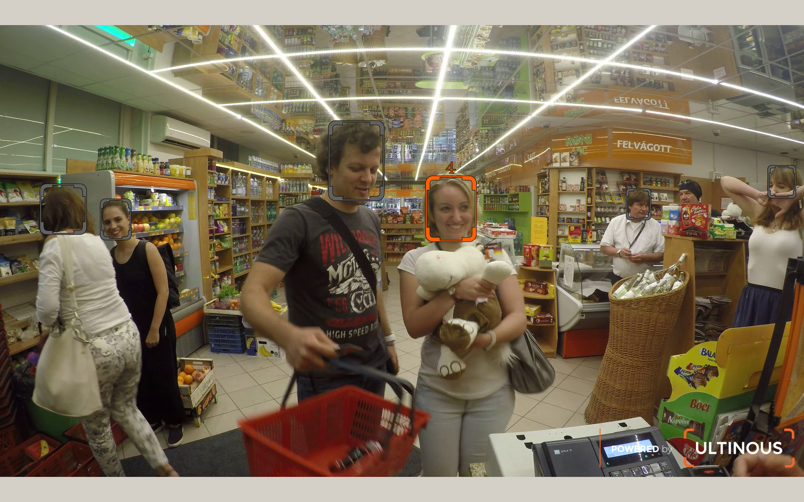
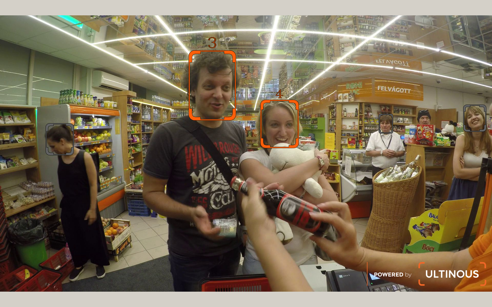

# Basic Reidentification Demo




The Basic Reidentification microservice processes feature vectors and finds re-appearances.
In the demo, identified people are marked with an orange bounding box and an auto increment ID. 
Not identified people are marked with a grey bounding box.
It is also possible to calculate the dwell time passed between the registration and reidentification.

Basic Reidentification MS requires video(s) with larger faces than 72 pixels, looking straight into 
the camera.

A camera can have several roles:
 - Registration only: the camera will only save the appearing people.
 - Reidentification only: the camera will only identify the previously saved people.
 - Both: The same camera also registers and reidentifies the appearing people.

It assumes [Basic Reidentification microservice](basic_reidentification_microservice.md) is running.

Required topics for a one-camera system (registration and reidentification are performed on the same camera ):
 - fve.cam.0.original.Image.jpg
 - fve.cam.0.dets.ObjectDetectionRecord.json
 - fve.cam.0.fvecs.FeatureVectorRecord.json
 - fve.cam.99.reids.ReidRecord.json

For a two-camera system an **additional** set of topics are needed (registration and reidentification are performed on separate cameras):
 - fve.cam.1.original.Image.jpg
 - fve.cam.1.dets.ObjectDetectionRecord.json
 - fve.cam.1.fvecs.FeatureVectorRecord.json


The results can be displayed with opencv-python or in browser.

## Display with opencv-python

1. Run the Docker container in interactive mode (detailed description can be found [here](../quick_start_guide.md#interactiveDockerMode)):
   ```
   $ xhost +
   $ docker run -it --rm --name "python_env" \
   -v "/tmp/.X11-unix":"/tmp/.X11-unix" \
   -v "${UVAP_HOME}/demo_applications":"/ultinous_app" \
   -e DISPLAY=$DISPLAY \
   --net=uvap \
   --env="QT_X11_NO_MITSHM=1" \
   ultinous/uvap:uvap_demo_applications_latest /bin/bash
   ```
1. opencv-python display modes:
   1. Display output on screen:
      * With one camera:
        ```
        <DOCKER># cd /ultinous_app
        <DOCKER># /usr/bin/python3.6 \
          apps/uvap/basic_reidentification_DEMO.py kafka:9092 fve -d
        ```
      * With two cameras:
        ```
        <DOCKER># cd /ultinous_app
        <DOCKER># /usr/bin/python3.6 \
          apps/uvap/basic_reidentification_2_DEMO.py kafka:9092 fve -d
        ```
   1. Display output on full screen:
      * With one camera:
        ````
        <DOCKER># cd /ultinous_app
        <DOCKER># /usr/bin/python3.6 \
          apps/uvap/basic_reidentification_DEMO.py kafka:9092 fve -f -d
        ```
      * With two cameras:
        ```
        <DOCKER># cd /ultinous_app
        <DOCKER># /usr/bin/python3.6 \
          apps/uvap/basic_reidentification_2_DEMO.py kafka:9092 fve -f \
          -d
        ```
   1. Write output to Kafka:
      * With one camera (output written to `fve.cam.0.reids.Image.jpg`):
        ```
        <DOCKER># cd /ultinous_app
        <DOCKER># /usr/bin/python3.6 \
          apps/uvap/basic_reidentification_DEMO.py kafka:9092 fve -o
        ```
      * With two cameras (output written to `fve.cam.1.reids.Image.jpg`):
        ```
        <DOCKER># cd /ultinous_app
        <DOCKER># /usr/bin/python3.6 \
          apps/uvap/basic_reidentification_2_DEMO.py kafka:9092 fve -o
        ```

## Web display for Kafka topic
The generally web display demo description can be found [here](../quick_start_guide.md#webDisplay).

1. Use case of the `run_demo.sh` (from the [Topic Writer Demo](../quick_start_guide.md#topicWriterDemoStarting) chapter):
   Running the basic reidentification demo assumes that the basic reidentification microservice is already running in fve mode
   (see [basic reidentification calculation](basic_reidentification_microservice.md)) and creating reidentification records.
   * With one camera:
     ```
     $ "${UVAP_HOME}"/scripts/run_demo.sh \
       --demo-name basic_reidentification \
       --demo-mode fve -- --net uvap
     ```
   * With two cameras:
     ```
     $ "${UVAP_HOME}"/scripts/run_demo.sh \
       --demo-name basic_reidentification_2 \
       --demo-mode fve -- --net uvap
     ```

   :exclamation: **Warning** :exclamation: After the first run of these scripts
    [set_retention.sh](../quick_start_guide.md#setRetention) script should be executed 
    manually because new (`*.Image.jpg`) topics are created.

1. Starting UVAP wep player (detailed description can be found [here](../quick_start_guide.md#playInTheBowser)):
   ```
   $ "${UVAP_HOME}"/scripts/run_web_player.sh -- --net uvap
   ```

1. Display in web browser
   Use this URL to [display the demo](../quick_start_guide.md#inTheBowser):
   * With one camera:
     ```
     http://localhost:9999#fve.cam.0.reids.Image.jpg
     ```
   * With two cameras:
     ```
     http://localhost:9999#fve.cam.1.reids.Image.jpg
     ```
