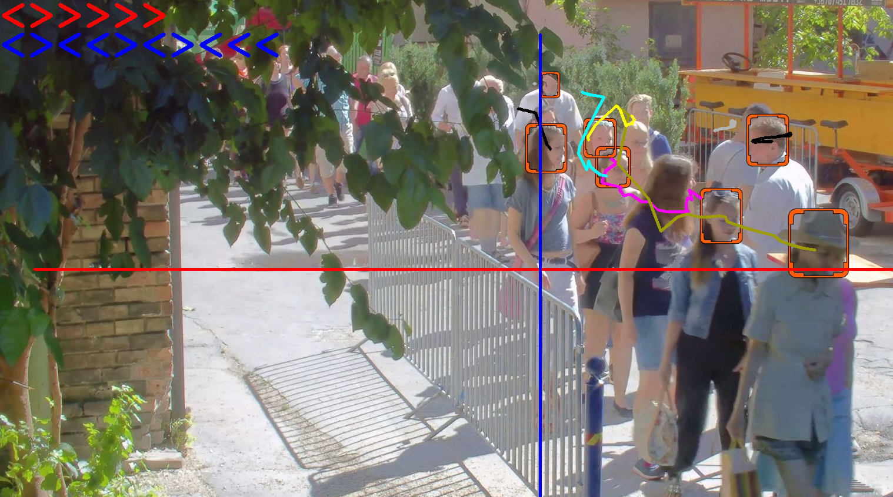

# Pass detection demo




Plays video from a jpeg topic, and visualizes the tracks of detected individuals,
 predefined polylines (passlines), and shows if any track intersects a passline.


Required topics:
- `<prefix>.cam.0.lowres.Image.jpg`
- `<prefix>.cam.0.dets.ObjectDetectionRecord.json`
- `<prefix>.cam.0.tracks.TrackChangeRecord.json`
- `<prefix>.cam.0.passdet.PassDetectionRecord.json`

The results can be displayed with opencv-python or in browser.

## Display with opencv-python

1. Run the docker container in interactive mode (detailed description can be found [here](../quick_start_guide.md#interactiveDockerMode)).
The demo application must know about the passlines to visualize it, and it can parse the properties file of the Kafka Pass Detection service,
therefore you have to mount it into the container. 
:
   ```
   $ xhost +
   $ docker run -it --rm --name "python_env" \
   -v "/tmp/.X11-unix":"/tmp/.X11-unix" \
   -v "$HOME/uvap/demo_applications":"/ultinous_app" \
   --mount type=bind,readonly,source=$HOME/uvap/models/uvap-kafka-passdet/uvap_kafka_passdet.properties,destination=/ultinous_app/models/uvap-kafka-passdet/uvap_kafka_passdet.properties \
   -e DISPLAY=$DISPLAY \
   --net=uvap \
   --env="QT_X11_NO_MITSHM=1" \
   ultinous/uvap:uvap_demo_applications_latest /bin/bash
   ```
1. opencv-python display modes:
   1. Display output on screen:
      ```
      <DOCKER># cd /ultinous_app
      <DOCKER># /usr/bin/python3.6 apps/uvap/pass_detection_DEMO.py kafka:9092 base /ultinous_app/models/uvap-kafka-passdet/uvap_kafka_passdet.properties -d
      ```
   1. Display output on full screen:
      ```
      <DOCKER># cd /ultinous_app
      <DOCKER># /usr/bin/python3.6 apps/uvap/pass_detection_DEMO.py kafka:9092 base /ultinous_app/models/uvap-kafka-passdet/uvap_kafka_passdet.properties -f -d
      ```
   1. Write output to `<prefix>.cam.0.tracks.Image.jpg`:
      ```
      <DOCKER># cd /ultinous_app
      <DOCKER># /usr/bin/python3.6 apps/uvap/pass_detection_DEMO.py kafka:9092 base /ultinous_app/models/uvap-kafka-passdet/uvap_kafka_passdet.properties -o
      ```

## Web display for Kafka topic
The generally web display demo description can be found [here](../quick_start_guide.md#webDisplay).

1. Use case of the `run_demo.sh` (from the [Topic Writer Demo](../quick_start_guide.md#topicWriterDemoStarting) chapter):
   ```
   $ ~/uvap/scripts/run_demo.sh --name-of-demo pass_detection --demo-mode base --config-file $HOME/uvap/models/uvap-kafka-passdet/uvap_kafka_passdet.properties
   ```
   :exclamation: **Warning** :exclamation: After the first run of these scripts
    [set_retention.sh](../quick_start_guide.md#setRetention) script should be executed 
    manually because new (`*.Image.jpg`) topics are created.

1. Starting UVAP web player (detailed description can be found [here](../quick_start_guide.md#playInTheBowser)):
   ```
   $ ~/uvap/scripts/run_web_player.sh --config-directory  "$HOME/uvap/models/uvap-web_player"
   ```

1. Display in web browser
   Use this URL to [display the demo](../quick_start_guide.md#inTheBowser):
   ```
   http://localhost:9999#base.cam.0.passdet.Image.jpg
   ```
